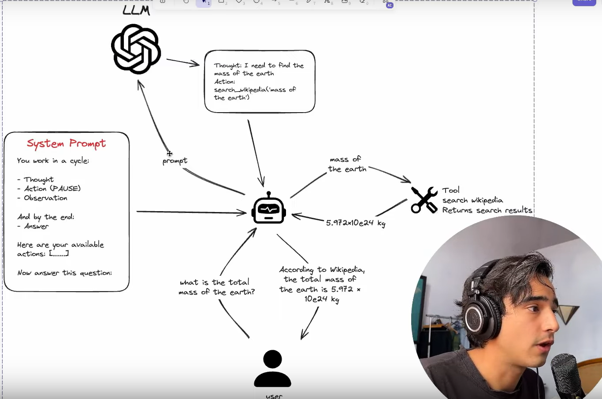

# Ciclo de um ReAct Agent

Primeiramente, nosso agente irá analisar o prompt do sistema, que deve ser algo do tipo:
    "Você trabalhará sempre no seguinte ciclo: primeiro você pensa sobre o problema dado, então você faz a ação necessária, pausa e e verifica se está condizente com o problema. Fique nesse loop até encontrar a resposta final, na qual você entregará ao sistema"

Uma coisa importante para se adicionar ao prompt inicial são as ferramentas disponíveis para uso, para que o sistema fique completo.

Basicamente, temos:
1- Usuário pede algo
2- Agente utiliza LLM para pensar sobre o problema que precisa resolver
3- Utiliza as ferramentas disponíveis para poder solucionar o problema da maneira mais precisa possível
4- Coleta a resposta da ferramenta, verifica se a resposta é condizente com o pedido que foi feito
5- Envia a resposta ao usuário se estiver satisfatório, caso contrário refaz os passos 2, 3 e 4.

# Início da aplicação prática.

## O primeiro passo é conseguir uma chave API no groq.

Temos que entrar no link do site do Groq
[Groq API KEY](https://console.groq.com/playground)

## Agora, seguimos para a criação do agente

Na documentação do groq, tem uma aba de quickstart. Copiaremos o código de la para iniciar a criação do agente.

Primeiro nós testamos a api para ver se está funcionando. Estando tudo ok, partiremos para a criação do Agente. Primeiro criamos a classe agente, e definimos algumas funções do agente.

### Class Agent()
Temos o agente, e quando iniciamos temos um client se inicializando e o system prompt (loop). Então criamos a lista de mensagens e se essa lista não estiver vazia, nós vamos incluí-la na lista como uma mensagem do sistema, em que terão as instruções primordiais do seu agente.

Então temos o metodo call que vai ser acionado toda vez que instanciarmos o Agent (classe). Temos duas possibilidades pra call do agente. A primeira é se caso chamarmos o agente com uma mensagem, então irá armazenar (.append) a mensagem na nossa lista 'messages=[]' e iremos executar a lm, que basicamente irá rodar todas as mensagens no modelo de linguagem (função execute) e irá armazenar tudo no resultado da call do modelo de linguagem e vai retornar esse resultado

### System Prompt
É um loop que deve fazer o LLM pensar, fazer a ação necessária, pausar, observar se aquilo que fez está correto e só parar esse loop se estiver. O prompt feito é baseado completamente na ideia do ReAcT.

### Tools
É basicamente as funções que devemos adicionar dos prompts feitos. Creio que se tivéssemos utilizando algum framework para isso, seria muito mais otimizado esse processo de fazer o setup das ferramentas

### Rodando o agente manualmente
Para rodar o agente manualmente, fizemos um passo a passo geral do nosso agente, manualmente.

### Criando um loop para rodar automaticamente
Para não ficar dando recall no agente toda vez, nós faremos o processo virar um loop para o agente pensar gradualmente até achar a solução por conta própria.

Para funcionar, devemos chamar o agente em um número máximo de iterações, no vídeo utilizamos 10 iterações como exemplo, e iremos rodar o agente e analisar o seu retorno todas as vezes.

Basicamente, estamos inicializando o agente, depois damos o nome das nossas ferramentas e daí iniciamos o nosso loop que irá chamar o agente e checar o resultado (passo a passo). Se o resultado incluir PAUSE e Action, deverá pegar o nome da ação (utilizando ReGEx), então o agente deve escolher a ferramenta a ser utilizada, e se conter nas ferramentas que o agente possui, ele executa, caso contrário, ele retorna que não possui a ferramenta ou que não foi possível selecionar a ferramenta correta.